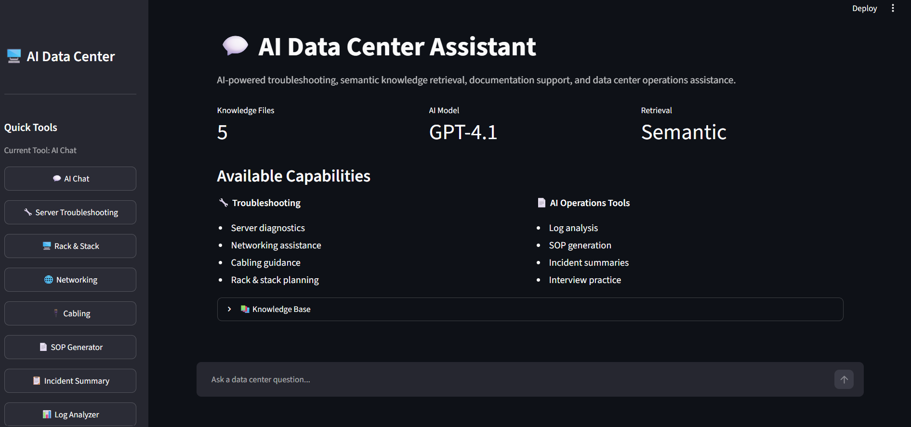
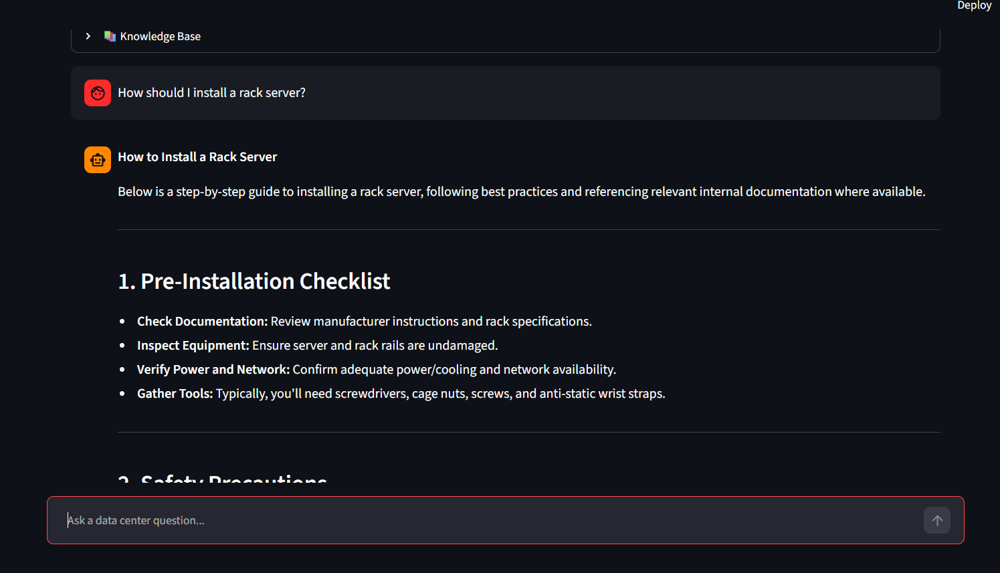
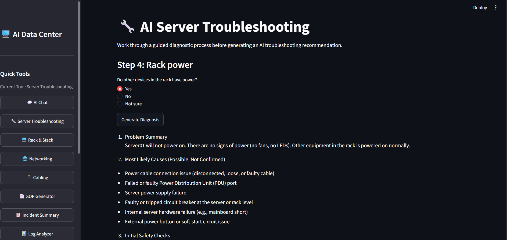
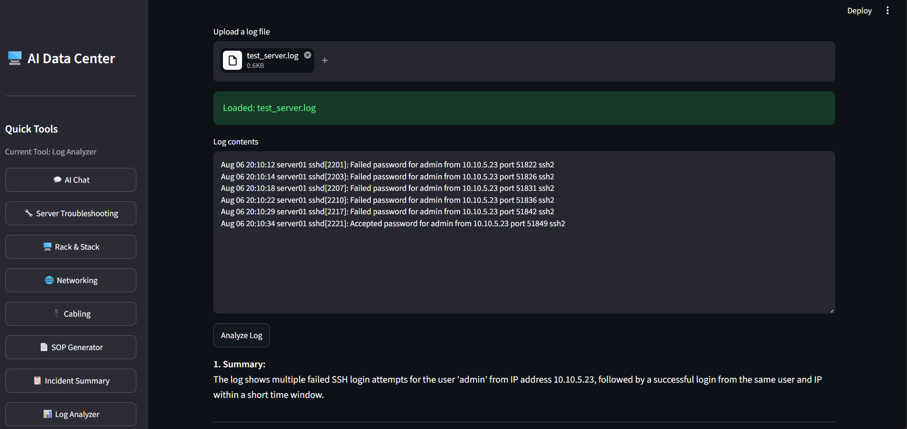
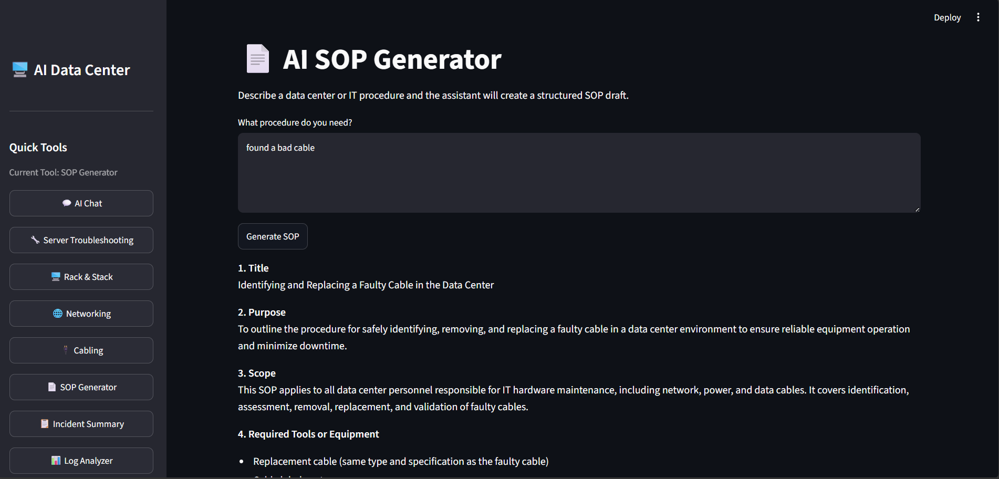

# 🖥️ AI Data Center Assistant

An AI-powered assistant designed to help data center technicians troubleshoot servers, analyze logs, generate documentation, and retrieve technical knowledge using semantic search.

---

# Overview

AI Data Center Assistant is a Streamlit application that combines OpenAI GPT-4.1 with a custom knowledge base to assist technicians with day-to-day data center operations.

The application performs semantic document retrieval before generating responses, allowing answers to be grounded in internal documentation instead of relying solely on the language model.

This project was built to demonstrate practical AI integration, retrieval-augmented generation (RAG), troubleshooting workflows, and Python application development.

---

# Features

### 💬 AI Chat

- Semantic knowledge retrieval
- Context-aware technical responses
- Conversation history
- Retrieved documentation display

---

### 🔧 Server Troubleshooting

Interactive troubleshooting wizard that guides technicians through diagnosing hardware issues.

- Guided workflow
- AI diagnosis
- Documentation retrieval
- Suggested next steps

---

### 📊 AI Log Analyzer

Upload or paste log files for AI analysis.

Provides:

- Summary
- Important events
- Root cause analysis
- Severity
- Recommendations
- Escalation guidance

---

### 📄 SOP Generator

Automatically creates structured Standard Operating Procedures.

---

### 📋 Incident Summary

Converts technician notes into professional incident reports.

---

### 🌐 Networking Assistant

Provides structured networking troubleshooting guidance.

---

### 🔌 Cabling Assistant

Assists with:

- Copper cabling
- Fiber optics
- Cable routing
- Labeling
- Best practices

---

### 🖥️ Rack & Stack Planner

Generates rack deployment recommendations including:

- Equipment placement
- Airflow
- Weight distribution
- Cable routing
- Power planning

---

### 🎤 Interview Practice

Simulates technical interviews for Data Center Technician roles.

Provides:

- Feedback
- Suggested improvements
- Stronger sample answers

---

# Technologies Used

- Python
- Streamlit
- OpenAI GPT-4.1 API
- OpenAI Embeddings
- Semantic Search
- Retrieval-Augmented Generation (RAG)
- Markdown Knowledge Base
- Git
- GitHub

---

# Architecture

User Question

↓

Semantic Search

↓

Knowledge Retrieval

↓

GPT-4.1

↓

Grounded AI Response

---

# Screenshots

## Homepage



---

## AI Chat



---

## Server Troubleshooter



---

## Log Analyzer



---

## SOP Generator



---

# Installation

Clone the repository

```bash
git clone https://github.com/luiz711/AI-Data-Center-Assistant.git
```

Install dependencies

```bash
pip install -r requirements.txt
```

Create a `.env` file

```text
OPENAI_API_KEY=your_api_key_here
```

Run

```bash
streamlit run app.py
```

---

# Future Improvements

- PDF report generation
- Vector database integration
- Authentication
- Technician ticket history
- Asset lookup
- Multi-user support

---

# Author

Luis Lopez Rangel

Test Technician III


Python • AI • Data Center Operations • Cybersecurity